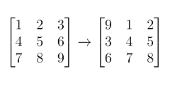
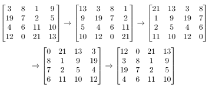

# Shift 2D Grid

## [Problem statement](https://leetcode.com/problems/shift-2d-grid/)

Given a 2D `grid` of size `m x n` and an integer `k`. You need to shift the grid `k` times.

In one shift operation:

* Element at `grid[i][j]` moves to `grid[i][j + 1]`.
* Element at `grid[i][n - 1]` moves to `grid[i + 1][0]`.
* Element at `grid[m - 1][n - 1]` moves to `grid[0][0]`.

Return the 2D grid after applying shift operation `k` times.

### Example 1

{width=220px}

```text
Input: grid = [[1,2,3],[4,5,6],[7,8,9]], k = 1
Output: [[9,1,2],[3,4,5],[6,7,8]]
```

### Example 2

{width=370px}

```text
Input: grid = [[3,8,1,9],[19,7,2,5],[4,6,11,10],[12,0,21,13]], k = 4
Output: [[12,0,21,13],[3,8,1,9],[19,7,2,5],[4,6,11,10]]
```

### Example 3
```text
Input: grid = [[1,2,3],[4,5,6],[7,8,9]], k = 9
Output: [[1,2,3],[4,5,6],[7,8,9]]
``` 

### Constraints

* `m == grid.length`.
* `n == grid[i].length`.
* `1 <= m <= 50`.
* `1 <= n <= 50`.
* `-1000 <= grid[i][j] <= 1000`.
* `0 <= k <= 100`.

## Solution: Convert a 2D array into a 1D one

You can convert the 2D `grid` into a 1D vector `v` to perform the shifting easier. One way of doing this is concatenating the rows of the matrix.

* If you shift the grid `k = i*N` times where `N = v.size()` and `i` is any non-negative integer, you go back to the original grid; i.e. you did not shift it.
* If you shift the grid `k` times with `0 < k < N`, the first element of the result starts from `v[N - k]`.
* In general, the first element of the result starts from `v[N - k%N]`.

### Example 1
For `grid = [[1,2,3],[4,5,6],[7,8,9]]`:

* It can be converted into a 1D vector `v = [1,2,3,4,5,6,7,8,9]` of size `m*n = 9`.
* With `k = 1` the shifted `grid` now starts from `v[9 - 1] = 9`.
* The final result is `grid = [[9,1,2][3,4,5][6,7,8]]`.

### Code
```cpp
#include <vector>
#include <iostream>
using namespace std;
vector<vector<int>> shiftGrid(vector<vector<int>>& grid, int k) {
    vector<int> v;
    for (auto& r : grid) {
        v.insert(v.end(), r.begin(), r.end());
    }
    const int m = grid.size();
    const int n = grid[0].size();
    int p = v.size() - (k % v.size());
    for (int i = 0; i < m; i++) {
        for (int j = 0; j < n; j++) {
            if (p == v.size()) {
                p = 0;
            }
            grid[i][j] = v[p++];
        }
    }
    return grid;
}
void printResult(vector<vector<int>>& grid) {
    cout << "[";
    for (auto& r : grid) {
        cout << "[";
        for (int a: r) {
            cout << a << ",";
        }
        cout << "]";
    }
    cout << "]\n";
}
int main() {
    vector<vector<int>> grid{{1,2,3},{4,5,6},{7,8,9}};
    auto result = shiftGrid(grid, 1);
    printResult(result);
    grid = {{3,8,1,9},{19,7,2,5},{4,6,11,10},{12,0,21,13}};
    result = shiftGrid(grid, 4);
    printResult(result);
    grid = {{1,2,3},{4,5,6},{7,8,9}};
    result = shiftGrid(grid, 9);
    printResult(result);
}
```
```text
Output:
[[9,1,2,][3,4,5,][6,7,8,]]
[[12,0,21,13,][3,8,1,9,][19,7,2,5,][4,6,11,10,]]
[[1,2,3,][4,5,6,][7,8,9,]]
```

### Complexity
* Runtime: `O(mn)` (the nested `for` loops), where `m = grid.length`, `n = grid[i].length`.
* Extra space: `O(mn)` (the vector `v`).

## C++ notes
1. To convert a 2D matrix into a 1D vector, you can use the vector's function [`insert()`](https://en.cppreference.com/w/cpp/container/vector/insert).
2. The modulo operator `%` is usually used to index an array to ensure the index is inbound.
