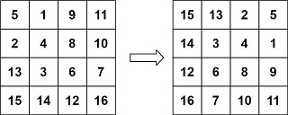

# Rotate Image


## [Problem statement](https://leetcode.com/problems/rotate-image/)

You are given an `n x n` 2D `matrix` representing an image. Rotate the image by 90 degrees (clockwise).

You have to rotate the image [in-place](https://en.wikipedia.org/wiki/In-place_algorithm), which means you have to modify the input 2D matrix directly. DO NOT allocate another 2D matrix and do the rotation.


### Example 1
{width=230px}
```text
Input: matrix = [[1,2,3],[4,5,6],[7,8,9]]
Output: [[7,4,1],[8,5,2],[9,6,3]]
```

### Example 2
{width=250px}
```text
Input: matrix = [[5,1,9,11],[2,4,8,10],[13,3,6,7],[15,14,12,16]]
Output: [[15,13,2,5],[14,3,4,1],[12,6,8,9],[16,7,10,11]]
``` 

### Constraints

* `n == matrix.length == matrix[i].length`.
* `1 <= n <= 20`.
* `-1000 <= matrix[i][j] <= 1000`.

## Solution: The math behind

For any square matrix, the rotation 90 degrees clockwise can be performed in two steps:

1. Transpose the matrix.
2. Mirror the matrix vertically.

## Code
```cpp
#include <iostream>
#include <vector>
using namespace std;
void rotate(vector<vector<int>>& matrix) {
    const int n = matrix.size();
    // transpose
    for (int i = 0; i < n; i++) {
        for (int j = i + 1; j < n; j++) {
            swap(matrix[i][j], matrix[j][i]);
        }
    }
    // vertical mirror
    for (int i = 0; i < n; i++) {
        for (int j = 0; j < n / 2; j++ ) {
            swap(matrix[i][j], matrix[i][n - 1 - j]);
        }
    }
}
void printMatrix(vector<vector<int>>& matrix) {
    cout << "[";
    for (auto& row: matrix) {
        cout << "[";
        for (auto& a: row) {
            cout << a << ",";
        }
        cout << "],";
    }
    cout << "]\n";
}
int main() {
    vector<vector<int>> matrix{{1,2,3},{4,5,6},{7,8,9}};
    rotate(matrix);
    printMatrix(matrix);
    matrix = {{5,1,9,11},{2,4,8,10},{13,3,6,7},{15,14,12,16}};
    rotate(matrix);
    printMatrix(matrix);
}
```
```text
Output:
[[7,4,1,],[8,5,2,],[9,6,3,],]
[[15,13,2,5,],[14,3,4,1,],[12,6,8,9,],[16,7,10,11,],]
```

### Complexity
* Runtime: `O(n^2)`, where `n = matrix.length`.
* Extra space: `O(1)`.

## Implementation notes
1. The function [`std::swap`](https://en.cppreference.com/w/cpp/algorithm/swap) can be used to exchange two values.
2. When doing the transpose or mirroring, you could visit over one-half of the matrix.
