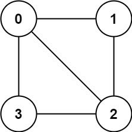

# Is Graph Bipartite?

## [Problem statement](https://leetcode.com/problems/is-graph-bipartite/)

There is an undirected graph with `n` nodes, where each node is numbered between `0` and `n - 1`. You are given a 2D array `graph`, where `graph[u]` is an array of nodes that node `u` is adjacent to. More formally, for each `v` in `graph[u]`, there is an undirected edge between node `u` and node `v`. The graph has the following properties:

- There are no self-edges (`graph[u]` does not contain `u`).
- There are no parallel edges (`graph[u]` does not contain duplicate values).
- If `v` is in `graph[u]`, then `u` is in `graph[v]` (the graph is undirected).
- The graph may not be connected, meaning there may be two nodes `u` and `v` such that there is no path between them.

A graph is **bipartite** if the nodes can be partitioned into two independent sets `A` and `B` such that every edge in the graph connects a node in set `A` and a node in set `B`.

Return `true` if and only if it is bipartite.

 

### Example 1




```plain
Input: graph = [[1,2,3],[0,2],[0,1,3],[0,2]]
Output: false
Explanation: There is no way to partition the nodes into two independent sets such that every edge connects a node in one and a node in the other.
```

### Example 2


```plain
Input: graph = [[1,3],[0,2],[1,3],[0,2]]
Output: true
Explanation: We can partition the nodes into two sets: {0, 2} and {1, 3}.
``` 

### Constraints

* `graph.length == n`.
* `1 <= n <= 100`.
* `0 <= graph[u].length < n`.
* `0 <= graph[u][i] <= n - 1`.
* `graph[u]` does not contain `u`.
* All the values of `graph[u]` are unique.
* If `graph[u]` contains `v`, then `graph[v]` contains `u`.

## Solution: Coloring the nodes by Depth First Search

You could color the nodes in set A with one color and those in B with another color. Then two ends of every edge have different colors.

Now you can use the [DFS algorithm](https://en.wikipedia.org/wiki/Depth-first_search) to perform the coloring on each connected component of the graph. 

During the traversal, if there is an edge having the same color at two ends then return `false`.

### Code
```cpp
#include <vector>
#include <iostream>
using namespace std;
bool isBipartite(vector<vector<int>>& graph) {
    vector<int> color(graph.size(), 0);
    for (int i = 0; i < graph.size(); i++) {
        if (color[i] != 0) continue;
        vector<int> s;
        s.push_back(i);
        color[i] = 1;
        while (!s.empty()) {
            int u = s.back();
            s.pop_back();
            for (int v : graph[u]) {
                if (color[v] == 0) {
                    color[v] = -color[u];
                    s.push_back(v);
                } else if (color[v] == color[u]) {
                    return false;
                }          
            }
        }

    }
    return true;
}
int main() {
    vector<vector<int>> graph{{1,2,3},{0,2},{0,1,3},{0,2}};
    cout << isBipartite(graph) << endl;
    graph = {{1,3},{0,2},{1,3},{0,2}};
    cout << isBipartite(graph) << endl;
}
```
```plain
Output:
0
1
```

### Complexity
* Runtime: `O(n)`, where `n = graph.length`.
* Extra space: `O(n)`.

## Implementation note
- This is the non-recursive implementation of DFS algorithm where you could use the stack data structure to avoid the recursion.
- The stack's methods needed in the DFS algorithm are only `push` and `pop`. There are similar ones in [`std::vector`](https://en.cppreference.com/w/cpp/container/vector), which are [`push_back`](https://en.cppreference.com/w/cpp/container/vector/push_back) and [`pop_back`](https://en.cppreference.com/w/cpp/container/vector/pop_back) which you could use well.

